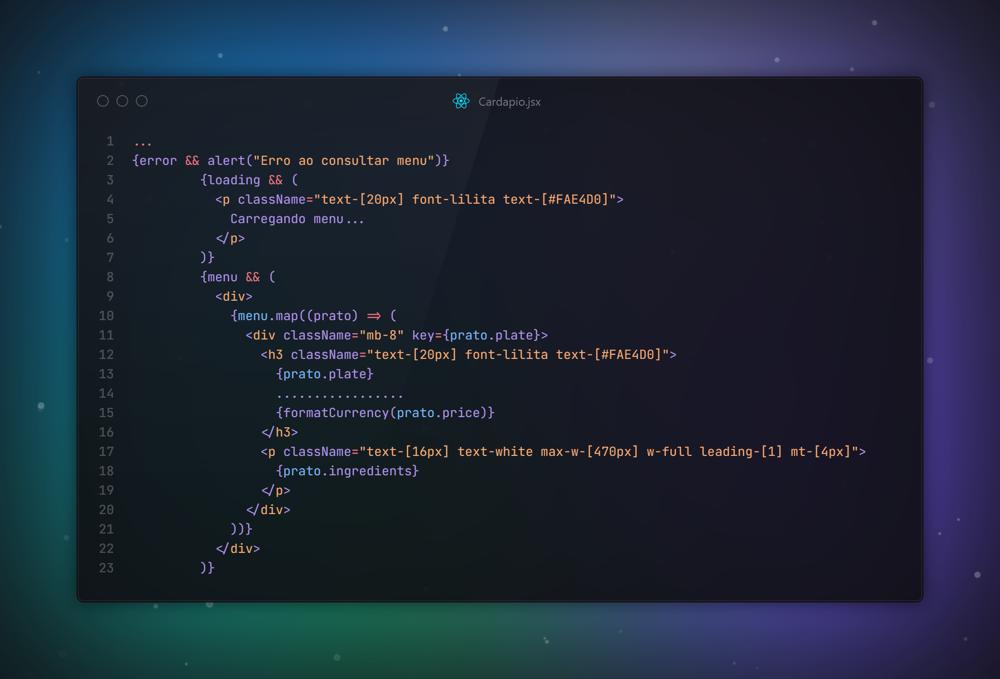

<h1 align="center">
  <br>
  <a href="https://github.com/JoaoPedroOM"></a>
  <br>
</h1>
<br />

## Principais Funcionalidades 📋

### Navegação:

- **Links de navegação**: Ao clicar em um item do menu, o usuário é levado para a seção correspondente.
- **Carrossel funcional**: Na seção de depoimentos, os feedbacks dos clientes são exibidos em um carrossel.


### Design Responsivo:

- **Layouts adaptáveis**: Garantia de que o site se adapte bem a diferentes tamanhos de tela, desde desktops até dispositivos móveis.
- **Navegação móvel**: Implementação de uma navegação eficiente para dispositivos móveis.

### Cardápio :

- **Renderização de uma lista de produtos disponíveis**: Inclui informações como nome e preço


## Como Usar 🎯

Para clonar e executar esta aplicação, você precisará do [Git](https://git-scm.com) e do [Node.js](https://nodejs.org/en/download/) (que vem com o [npm](http://npmjs.com)) instalados em seu computador. No seu terminal:

```bash
# Clone este repositório
$ git clone https://github.com/JoaoPedroOM/Empire-Burguer.git

# Entre no repositório
$ cd empire-burguer

# Instale as dependências
$ npm install

# Execute o aplicativo
$ npm run dev

```

## Dados 📁
O aplicativo consome dados de uma API para buscar a lista de itens do cardápio e os depoimentos dos clientes. As informações são renderizadas dinamicamente a partir das respostas da API.

<h1 align="center">
  </a>
</h1>

## Stack utilizada 💻

- ReactJS
- Tailwind CSS
- Figma (Protótipo desenvolvido pelo designer Tiago Alves)

##

<p align="center">Made with ❤️ by <strong><a href="https://github.com/JoaoPedroOM" target="_blank">João Pedro</a></strong> 🍔 </p>